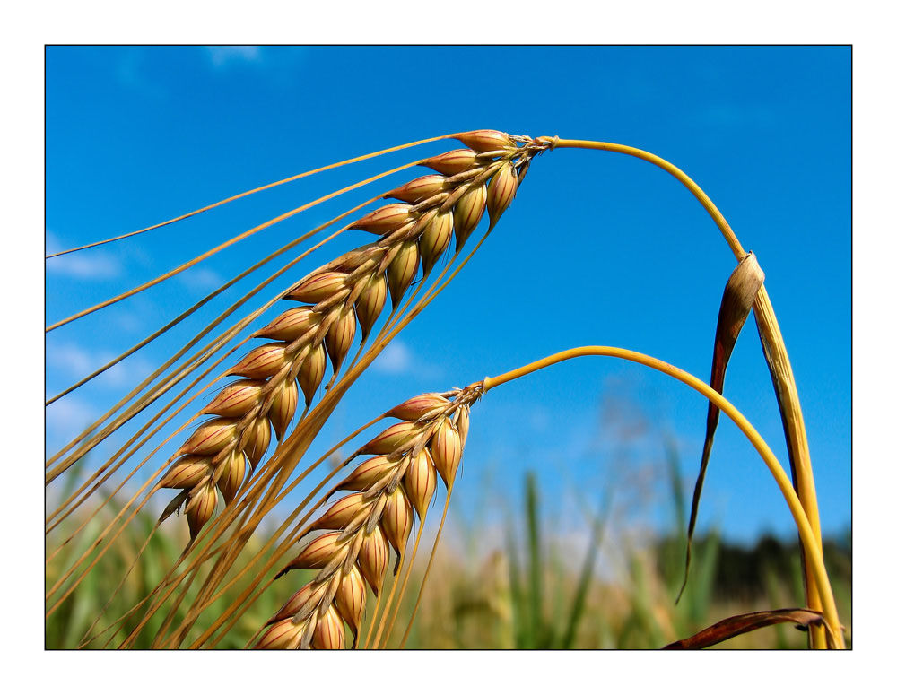
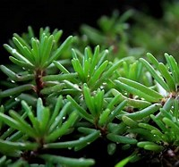

# 利用HTML在你的网页中包含图像

## 1.添加图像

使用``元素向页面添加图片。``元素包含两个特性：  
`src`告诉浏览器在何处找到所需的图片文件。该值通常是一个指向网站内某个图像的相对URI。  
`alt`特性对图片进行文本说明。  
`title`特性用来提供有关图像的附加信息。

```html

```

## 2.图像的宽度和高度

使用``的另外两个特性来指定它的大小。  
`height`以像素为单位来指定图像的高度，`width`这个特性以像素为单位来指定图像的宽度

```html

```

## 3.在代码插入图像的位置

### 1.在段落前插入图片，段落会另起一行显示

### 2.在段落起始处，段落文本第一行将于图像的底部对齐

### 3.在段落中，图像将位于它所在段落文字之中

```html

<p>There are around 10,000 living species of birds that inhabit different ecosystems from the Arctic to the Antarctic. Many species undertake long distance annual migrations, and many more perform shoter irregular journeys.</p>
<hr />
<p>There are around 10,000 living species of birds that inhabit different ecosystems from the Arctic to the Antarctic. Many species undertake long distance annual migrations, and many more perform shoter irregular journeys.</p>
<hr />
<p>There are around 10,000 living species of birds that inhabit different ecosystems from the Arctic to the Antarctic. Many species undertake long distance annual migrations, and many more perform shoter irregular journeys.
```

## 4.HTML5:图形和图形说明

`<figure>`元素用来包含图像以及对图像的说明  
`<figcaption>`元素是为了让网页设计人员给图像添加说明

```html
<figure>
    
    <br />
    <figcaption> Sea otters hold hands when they sleep so they don't drift away form each other.</figcaption>
</figure>
```

## 5.小结

>* ``元素用于向网页添加图像
>* 必须为``添加`src`特性和`alt`特性
>* 应该根据图像在网页显示的大小来保存图像
>* 照片最好保存为JPEG格式；使用单色的插图更适合保存为GIF格式

